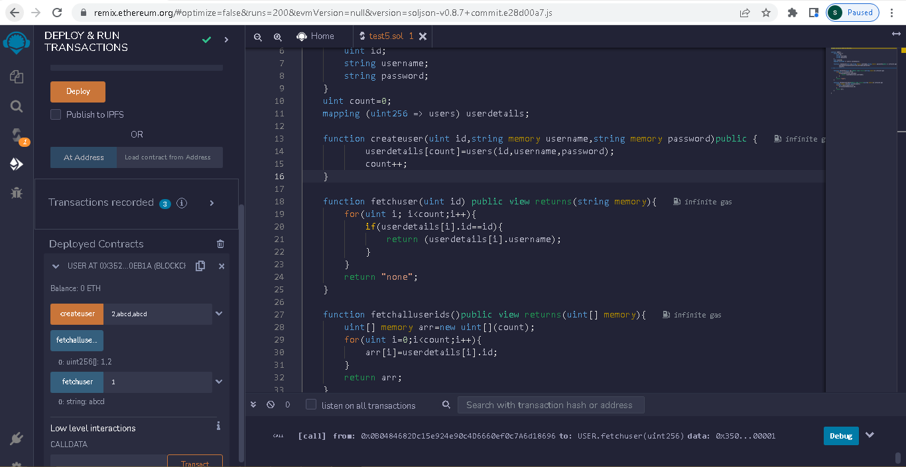
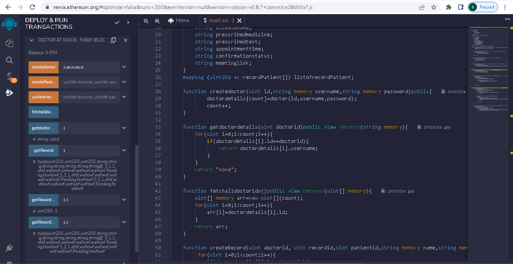
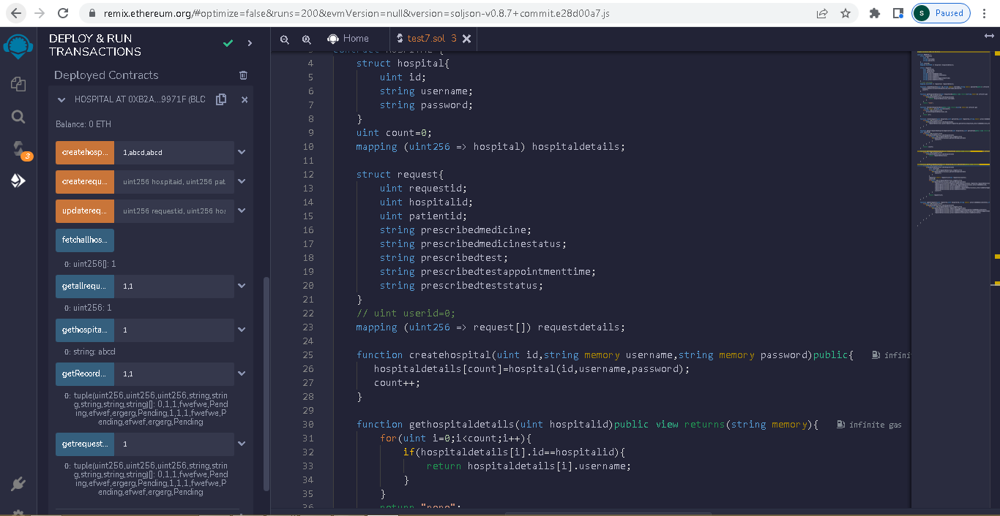
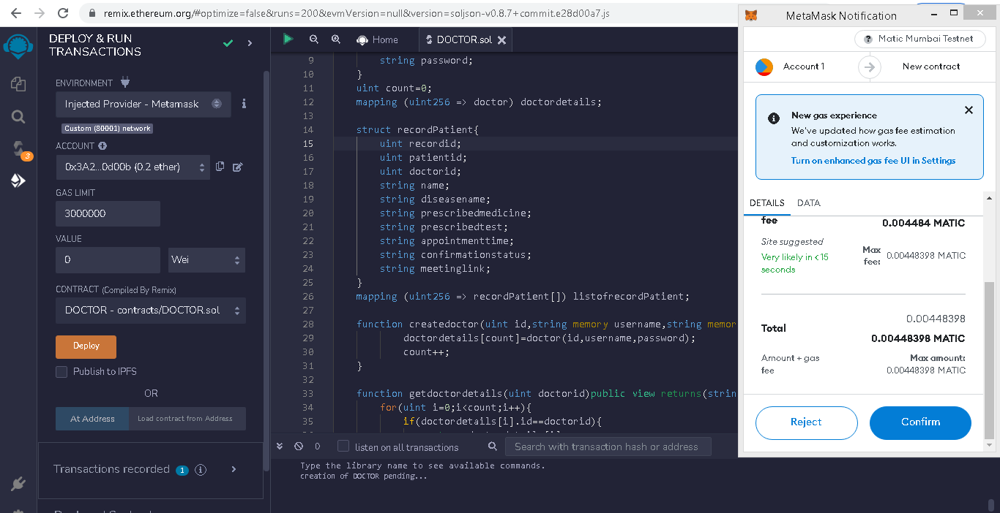
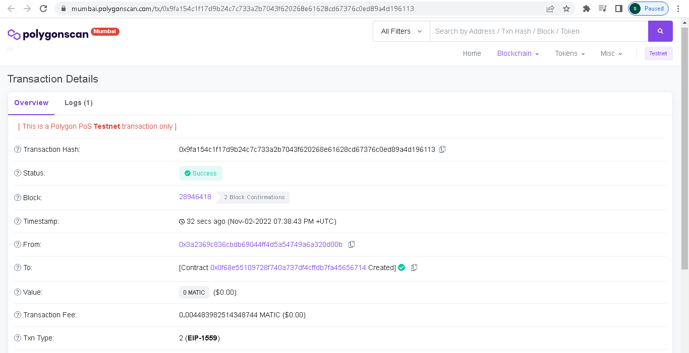
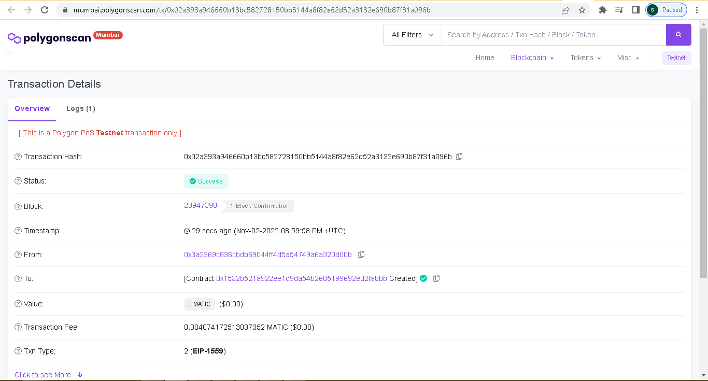
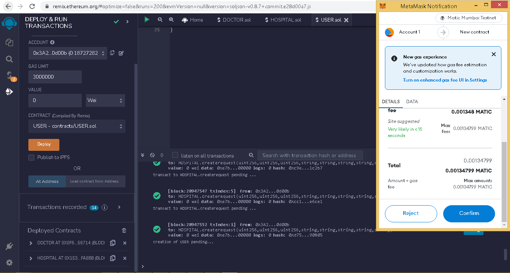

Fair Coomunication in Health Services using Multi Chain in Polygon  
Technical Stack :
Front-End : JavaScript, HTML,CSS,ES6
Back-End :  NodeJS,Express,Solidity
Problem Solving : Data Structures And Algorithms
